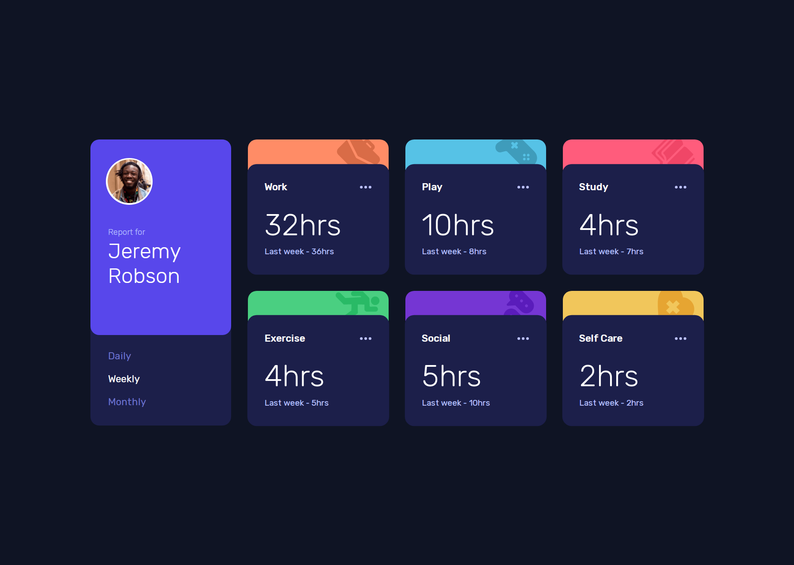

# Frontend Mentor - Time tracking dashboard solution

This is a solution to the [Time tracking dashboard challenge on Frontend Mentor](https://www.frontendmentor.io/challenges/time-tracking-dashboard-UIQ7167Jw). Frontend Mentor challenges help you improve your coding skills by building realistic projects. 

## Table of contents

- [The challenge](#the-challenge)
- [Screenshot](#screenshot)
- [Links](#links)
- [Useful resources](#useful-resources)
- [Author](#author)

## Overview

## The challenge

Users should be able to:

- View the optimal layout for the site depending on their device's screen size
- See hover states for all interactive elements on the page
- Switch between viewing Daily, Weekly, and Monthly stats

## Screenshot

## Links

- Solution URL: [GitHub Repository](https://github.com/joangute/time-tracking-dashboard/)
- Live Site URL: [GitHub Pages](https://joangute.github.io/time-tracking-dashboard/)

## Useful resources

- [CSS Tricks](https://css-tricks.com/) - This is very useful to find solutions in css.

## Author

- Frontend Mentor - [@joangute](https://www.frontendmentor.io/profile/joangute)